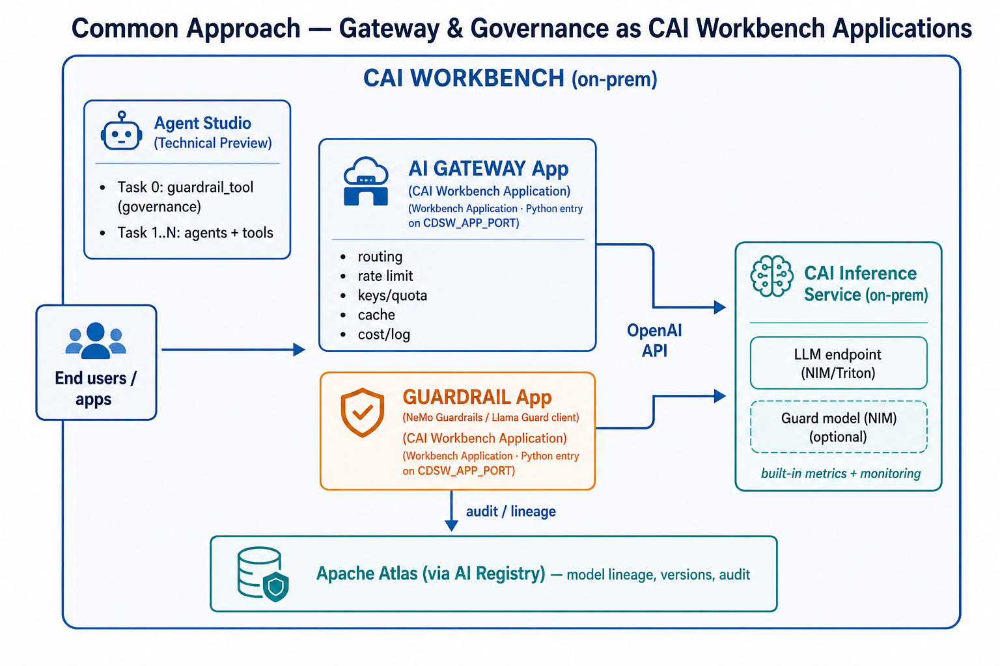
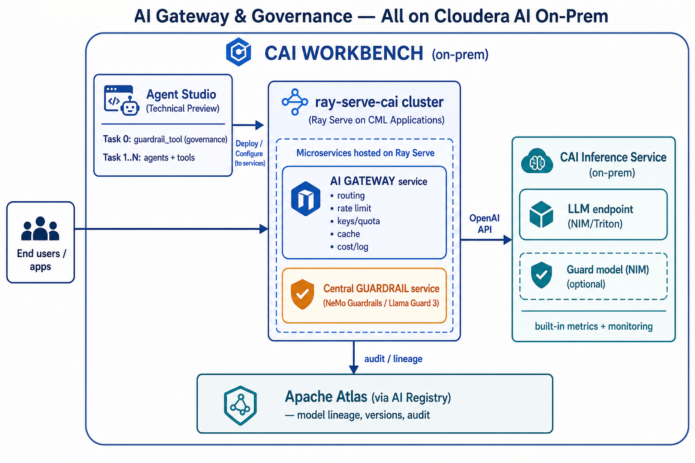

# AI Gateway & AI Governance for Cloudera AI (CAI) On-Prem

**Audience:** Solution architects positioning Cloudera AI for an on-prem customer who has purchased CAI instances and needs an AI gateway and AI governance story.

**Guiding principle:** **Keep the customer inside CAI.** Every plane below is hosted on Cloudera AI primitives — no external gateway, no third-party SaaS, no data leaving the cluster.

**Status:** Field guidance based on current CAI capabilities (mid-2026). Reassess as CAI Inference Service Application serving reaches on-prem GA.

---

## 1. The Current Picture

| # | Capability | State on-prem | Notes |
|---|---|---|---|
| 1 | **CAI Inference Service** | ✅ GA | Production-grade model serving via NVIDIA NIM + Triton on KServe. Exposes the **OpenAI API** for generative models and **Open Inference Protocol** for predictive models. Has **built-in monitoring and metrics**, and integrates with **Cloudera AI Registry** (Atlas-backed). ([CAI Inference Overview](https://docs.cloudera.com/machine-learning/cloud/ai-inference/topics/ml-caii-use-caii.html)) |
| 2 | **CAI Workbench Applications** | ✅ GA | Flexible long-running web apps, but the entry point must be a **Python script** on `CDSW_APP_PORT` / `CDSW_READONLY_PORT`. App engines do not autoscale/scale-to-zero like inference endpoints. ([Analytical Applications](https://docs.cloudera.com/machine-learning/cloud/applications/topics/ml-applications-c.html)) |
| 3 | **CAI Inference Service Applications** | ☁️ Cloud only | Custom Docker images, MCP clients/servers, autoscaling, scale-to-zero — **not yet on-prem**. ([CAII Application Serving](https://docs.cloudera.com/machine-learning/cloud/ai-inference/topics/ml-caii-application-serving-overview.html)) |
| 4 | **AI Gateway & AI Governance** | ❌ No out-of-box component | CAI does not yet ship a dedicated AI gateway or centralised AI governance plane — we assemble both **on CAI**. |

**Agent Studio** (and RAG / Fine-Tuning / Synthetic Data Studios) run **inside the CAI Workbench** as AI Studios (Technical Preview). ([AI Studios Overview](https://docs.cloudera.com/machine-learning/cloud/setup-ai-studios/topics/ml-ai-studios-overview.html), [Provisioning Workbenches](https://docs.cloudera.com/machine-learning/cloud/workspaces/topics/ml-provision-workspaces.html))

---

## 2. What "AI Gateway" and "AI Governance" Mean Here

### AI Gateway (the *traffic* plane)
A reverse proxy between applications/agents and model endpoints:

- Unified OpenAI-compatible API across many models
- Routing, load balancing, fallback, retries
- Rate limiting and quota enforcement per team/key
- API key / token issuance and rotation
- Semantic + exact-match response caching
- Cost and token accounting
- Request/response logging and tracing

### AI Governance (the *control* plane)
Policy, safety, and auditability over what flows through the gateway:

- Input safety — prompt-injection / jailbreak / data-exfiltration defence
- Output safety — content moderation, PII/secret redaction
- Prompt & completion audit trail for compliance
- Model lineage, versioning, and access control
- Drift / quality monitoring

> **Key insight:** CAI already gives you the two hardest pieces — a **production model-serving plane with metrics** (Inference Service) and a **lineage/registry backbone** (AI Registry + Atlas). The missing **gateway proxy** and **central guardrail** are added on top, **entirely within CAI**. This document presents two deployment tiers: a **common approach** that any partner can stand up today using CAI Workbench Applications, and an **advanced approach** built on `ray-serve-cai` (a Cloudera Professional Services capability, currently in progress).

---

## 3. Recommended On-Prem Architecture — A Progressive Path (All on CAI)

Both tiers solve the same three planes — **Plane A: AI Gateway**, **Plane B: Central Guardrail**, **Plane C: Audit & Lineage** — and both keep everything inside CAI. They differ only in *how the gateway and guardrail are hosted*:

| Tier | Hosting substrate | Availability | Best for |
|---|---|---|---|
| **Common (baseline)** | Stand-alone **CAI Workbench Applications** (Python entry on `CDSW_APP_PORT`) | **Available today** — any partner/SI can build it | Getting to a working, fully-on-CAI gateway + governance quickly |
| **Advanced** | **`ray-serve-cai`** microservices (Ray Serve on CML Applications) | **Cloudera Professional Services — in progress** | Production scale, autoscaling, multi-model routing, shared central services |

> **Recommendation for partners:** start with the **common approach** to deliver value immediately. Graduate to the **advanced `ray-serve-cai`** tier when the customer needs production-grade scaling, higher throughput, or a shared central gateway/guardrail across many workflows — engage Cloudera Professional Services for that stage.

---

### 3.1 Common Approach (Available Now) — Stand-alone CAI Workbench Applications

Host the gateway and the guardrail as **two independent CAI Workbench Applications**, each a single Python entry script served on `CDSW_APP_PORT`. ([Analytical Applications](https://docs.cloudera.com/machine-learning/cloud/applications/topics/ml-applications-c.html)) Both call the CAI Inference Service models over the OpenAI API. Nothing leaves CAI.



**AI Gateway Application:** run a lightweight OpenAI-compatible proxy (e.g. a LiteLLM proxy, or a small FastAPI app) as the Workbench Application's Python entry point. It provides routing, per-key rate limiting/quota, response caching, and cost/token logging in front of the CAI Inference endpoints.

**Guardrail Application:** run a guardrail server (e.g. **NeMo Guardrails**, or a thin service that calls a **Llama Guard 3** model hosted on CAI Inference) as a second Workbench Application. Agent Studio's `guardrail_tool` points its Layer 2 `api` mode at this application's endpoint.

| Strengths | Trade-offs |
|---|---|
| Available **today** on any on-prem CAI; no Professional Services dependency | Each app is a **single Python entry** — limited horizontal scaling |
| Simple to build, version, and hand over to an SI | App engines do **not** autoscale / scale-to-zero like inference endpoints |
| Fully inside CAI; uses CAI auth and networking | Gateway and guardrail are separate apps to operate individually |

---

### 3.2 Advanced Approach (Cloudera Professional Services — In Progress) — `ray-serve-cai` Microservices

For production scale, host the gateway and guardrail as **Ray Serve microservices** via **`ray-serve-cai`**, which launches a Ray cluster using **CML Applications as nodes** (1 head + N workers) entirely within the CAI Workbench. These microservices speak the OpenAI API to the CAI Inference Service.

> **`ray-serve-cai` is a Cloudera internal Professional Services capability, currently in progress.** Engage the Cloudera PS team to deploy this tier. It supersedes the common approach for customers who need throughput, autoscaling, and shared central services.



**What `ray-serve-cai` adds over the common approach:**

- **Launches a Ray cluster on CAI** using CML Applications as nodes (head with no GPU + GPU workers). ([ray-serve-cai README](../../ray-serve-cai/README.md))
- **Autoscaling across worker nodes** instead of a single Python entry per app.
- **OpenAI-compatible** serving surface — gateway and guard models are drop-in for any OpenAI client.
- **Plugin engine architecture** (vLLM stable; SGLang/custom planned) to host guard models or small auxiliary models directly on the cluster.
- **One shared cluster** hosts both the gateway and the central guardrail microservices, so policy and routing are centralised across all workflows.

**Division of labour (advanced tier):**

| Layer | Hosts | Runs on |
|---|---|---|
| **CAI Inference Service** | Production LLMs (+ optional guard model via NIM) | KServe / NIM / Triton |
| **`ray-serve-cai` cluster** | AI Gateway microservice, Central Guardrail microservice, small auxiliary models | Ray Serve on CML Applications |
| **Agent Studio** | Workflows, agents, `guardrail_tool` (Task 0) | CAI Workbench |
| **Atlas / AI Registry** | Lineage, versions, audit | CAI governance integration |

---

## 4. The Three Planes (apply to both tiers)

### Plane A — AI Gateway

| Responsibility | Common (Workbench App) | Advanced (`ray-serve-cai`) |
|---|---|---|
| Unified OpenAI API | Single proxy app exposes `/v1` | Ray Serve deployment exposes `/v1` |
| Routing / fallback | Proxy routes by model name to CAI Inference endpoints | Gateway deployment routes across CAI Inference + Ray-hosted models |
| Rate limit / quota / keys | In the proxy app (per-key budgets) | In the gateway deployment, cluster-wide |
| Caching | In-app cache | Ray Serve shared cache deployment |
| Cost / logging | App emits per-request records | Gateway emits records; Ray dashboard + metrics |

### Plane B — Central Guardrail + the `guardrail_tool`

The central guardrail server can be **NeMo Guardrails** or a **Llama Guard 3** model — hosted as a Workbench Application (common) or a Ray Serve microservice (advanced). Either way, the heavy guard-model inference can also sit on the **CAI Inference Service** (NIM), with the guardrail server orchestrating rail logic in front of it.

This project's **`guardrail_tool`** (`studio-data/tool_templates/guardrail_tool/`) is one of the **tools that connects to the central guardrail server / CAI Inference services**. It runs as **Task 0** in Agent Studio workflows and enforces input safety before prompts reach downstream agents:

| Layer | Mechanism | Where it runs on CAI |
|---|---|---|
| **1 — Regex / heuristics** | Prompt-injection, jailbreak, SQL-DDL, schema-fishing | In-process (stdlib), < 1 ms |
| **2 — ML classifier** | `api` mode → **central guardrail server** (Llama Guard 3 / NeMo Guardrails) | Workbench App or Ray Serve microservice or CAII endpoint |
| **3 — Domain policy** | Table allowlists, sensitive-column (PII/credentials/financial) blocking | In-process, < 5 ms |

Point Layer 2 at the central guardrail endpoint (same config in both tiers — only the URL changes):

```json
{
  "mode": "api",
  "domain": "text_to_sql",
  "classifier_endpoint": "https://<guardrail-app-or-ray-endpoint>/v1",
  "classifier_api_key": "<cdp-jwt>",
  "api_type": "openai_compatible",
  "classifier_threshold": 0.85
}
```

This gives **defence in depth**: cheap local regex/policy in the tool, plus a centralised model-based rail on CAI for the hard cases. Multiple tools and applications share the one guardrail server, so policy is consistent and centrally updatable.

### Plane C — Audit & Lineage (identical in both tiers)

- **Model lineage / versioning / access control:** **CAI Registry + Apache Atlas** (enable *Governance* at workbench provisioning). ([CAI Inference Overview](https://docs.cloudera.com/machine-learning/cloud/ai-inference/topics/ml-caii-use-caii.html))
- **Prompt / completion audit trail:** captured at the **gateway** (Plane A) and written to the customer's on-prem log store.
- **Workflow-level audit:** Agent Studio persists every task input/output, including each `guardrail_tool` verdict (ALLOW/BLOCK + threat categories + layer).

---

## 5. Recommended Solution by Time Horizon

| Horizon | AI Gateway | AI Governance |
|---|---|---|
| **Now — common approach** | Gateway as a **stand-alone CAI Workbench Application** (OpenAI-compatible proxy) fronting CAI Inference endpoints | Guardrail **Workbench Application** (NeMo Guardrails / Llama Guard 3) + `guardrail_tool` as Task 0 + Atlas/AI Registry lineage |
| **Pilot / quick demo** | Single proxy Workbench Application | `guardrail_tool` in `mode: local` (Prompt-Guard-86M, no extra endpoint) |
| **Advanced — `ray-serve-cai` (Cloudera PS, in progress)** | Gateway as a **Ray Serve microservice** with autoscaling and multi-model routing | Central **guardrail microservice** on the same Ray cluster, shared across all workflows |
| **Future (CAII App serving on-prem GA)** | Migrate gateway + guardrail to **CAI Inference Service Applications** (custom Docker, scale-to-zero, MCP-native) | Same governance planes; co-locate guard models and policies in the CAII application |

---

## 6. Why This Is the Best Available Answer

1. **The customer stays in CAI.** Gateway, guardrail, models, and lineage all run on Cloudera AI — no external gateway, no data egress, ideal for regulated on-prem buyers.
2. **Progressive adoption.** Partners deliver value immediately with the common Workbench-Application approach, then graduate to the advanced `ray-serve-cai` tier (Cloudera Professional Services) when scale demands it — with no rewrite, since both speak the OpenAI API.
3. **Reuses CAI's strongest assets.** Inference Service gives production serving + metrics; AI Registry gives Atlas lineage. We add only the two missing planes — both on CAI.
4. **Centralised, consistent governance.** One guardrail server serves every workflow and app; the `guardrail_tool` adds in-workflow defence in depth and shares the same central policy endpoint.
5. **Forward-compatible.** Because everything speaks the OpenAI API, Workbench Applications, Ray Serve microservices, and the future on-prem CAII Application deployment are all drop-in swappable.
6. **Governance is already in this repo.** The `guardrail_tool` is built, documented, and slots into Agent Studio as Task 0 with `local` or central-server `api` modes.

---

## 7. References

- [Cloudera AI Inference service Overview](https://docs.cloudera.com/machine-learning/cloud/ai-inference/topics/ml-caii-use-caii.html)
- [Provisioning Cloudera AI Workbenches](https://docs.cloudera.com/machine-learning/cloud/workspaces/topics/ml-provision-workspaces.html)
- [AI Studios Overview (Technical Preview)](https://docs.cloudera.com/machine-learning/cloud/setup-ai-studios/topics/ml-ai-studios-overview.html)
- [Analytical Applications (Workbench)](https://docs.cloudera.com/machine-learning/cloud/applications/topics/ml-applications-c.html)
- [Serving Applications on Cloudera AI Inference service (Technical Preview)](https://docs.cloudera.com/machine-learning/cloud/ai-inference/topics/ml-caii-application-serving-overview.html)
- Microservice hosting layer: `ray-serve-cai` (`/Users/zhongqishuai/Projects/cldr_projects/ray-serve-cai`)
- Project governance tool: `studio-data/tool_templates/guardrail_tool/` (see its `README.md`)
