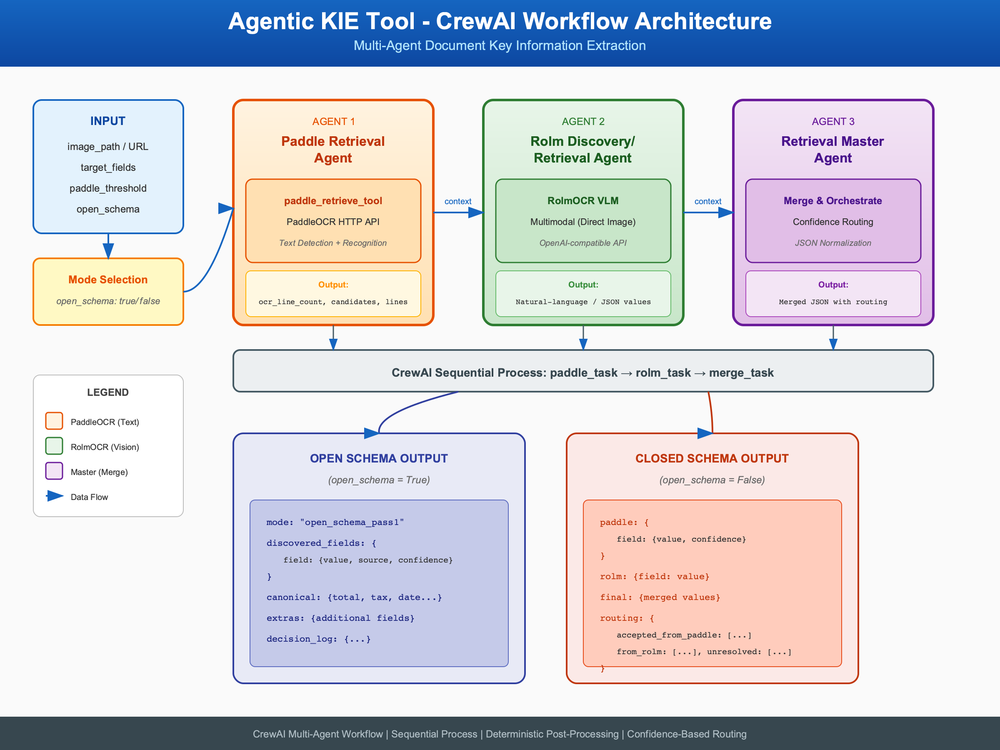

# Agentic KIE Tool

Multi-agent CrewAI workflow for **Key Information Extraction (KIE)** from invoices and receipts.

## Overview

Uses three agents:

- **Paddle Retrieval Agent**: Calls Paddle OCR to get OCR evidence and candidate fields.
- **Rolm Discovery Agent**: Uses RolmOCR to discover additional key-value fields.
- **Master Agent**: Merges results into a canonical output with `discovered_fields`, `canonical`, and `extras`.

Supports two modes:

- **Open schema** (default): Dynamic field discovery in pass-1.
- **Closed schema**: Extract only specified `target_fields` using Paddle candidates above a threshold.

## Architecture



The diagram above illustrates the multi-agent workflow:
1. **Input** is received (image path/URL + schema mode)
2. **Paddle Retrieval Agent** and **Rolm Discovery Agent** process the image in parallel
3. **Master Agent** merges and reconciles results from both agents
4. **Output** is returned in the requested format (deterministic or full)

## UserParameters (Tool Configuration)

| Parameter         | Type | Required | Default            | Description                                      |
| ----------------- | ---- | -------- | ------------------ | ------------------------------------------------ |
| `paddle_url`      | str  | Yes      | -                  | Paddle OCR endpoint URL                          |
| `rolm_url`        | str  | Yes      | -                  | RolmOCR OpenAI-compatible endpoint URL          |
| `jwt_token`       | str  | Yes      | -                  | Bearer token for OCR APIs (Paddle + Rolm)        |
| `rolm_model`      | str  | No       | `reducto/RolmOCR`  | RolmOCR model name                              |
| `llm_model`       | str  | No       | `gpt-4.1-mini`     | Master agent LLM model                           |
| `llm_base_url`    | str  | Yes      | -                  | OpenAI-compatible base URL for Master agent     |
| `llm_api_key`     | str  | Yes      | -                  | API key for Master agent                         |
| `timeout_seconds` | int  | No       | 300                | Max runtime per image (seconds)                  |

## ToolParameters (Per-Invocation Arguments)

| Parameter          | Type   | Required | Default         | Description                                                              |
| ------------------ | ------ | -------- | --------------- | ------------------------------------------------------------------------ |
| `action`           | str    | No       | `"extract"`     | Action to perform (currently only `extract`)                              |
| `image_source`     | str    | Yes      | -               | Local file path or HTTP/HTTPS URL to invoice/receipt image                |
| `open_schema`      | bool   | No       | `true`          | Enable dynamic field discovery; if false, use `target_fields`             |
| `target_fields`    | str    | No       | -               | Comma-separated fields for closed-schema (e.g. `total,subtotal,tax`)      |
| `paddle_threshold` | float  | No       | 0.80            | Confidence threshold for Paddle candidates in closed-schema mode         |
| `output_mode`      | str    | No       | `"deterministic"`| `"deterministic"` (canonical/extras) or `"full"` (entire result)           |

## Usage

### CAI Studio Invocation

The tool is invoked via CLI:

```bash
python tool.py --user-params '<json>' --tool-params '<json>'
```

**Example user-params JSON:**

```json
{
  "paddle_url": "https://.../paddle-ocr/v1/infer",
  "rolm_url": "https://.../v1",
  "jwt_token": "eyJ...",
  "llm_model": "gpt-4.1-mini",
  "llm_base_url": "https://api.openai.com/v1",
  "llm_api_key": "sk-..."
}
```

**Example tool-params JSON:**

```json
{
  "action": "extract",
  "image_source": "/path/to/invoice.png",
  "open_schema": true,
  "output_mode": "deterministic"
}
```

For closed-schema:

```json
{
  "action": "extract",
  "image_source": "https://example.com/receipt.jpg",
  "open_schema": false,
  "target_fields": "total,subtotal,tax,date,currency",
  "paddle_threshold": 0.85
}
```

### Output

Output is printed as `tool_output <json>`. CAI Studio parses using `OUTPUT_KEY = "tool_output"`.

**Deterministic output** (default):

```json
{
  "discovered_fields": { ... },
  "canonical": { ... },
  "extras": { ... }
}
```

**Full output** (`output_mode: "full"`): Includes `deterministic_output` plus decision log and raw agent outputs.

## Sync with Source Repo

The workflow and agent tools are bundled from the multi-page-invoice-recognition project. To update the tool after source changes:

```bash
cd multi-page-invoice-recognition
python scripts/sync_agentic_kie_tool.py
```

Requires both repos to be present (multi-page-invoice-recognition and CAI_STUDIO_AGENT) with the expected relative paths. See `scripts/sync_agentic_kie_tool.py` for details.
