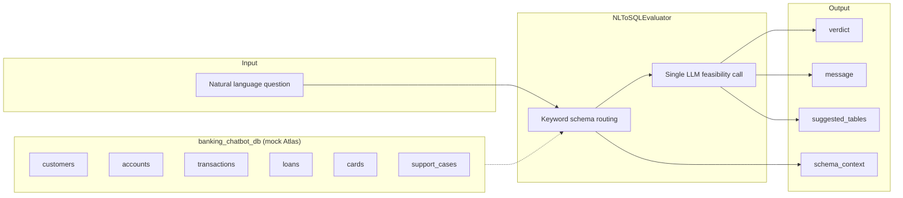

# NL Query Evaluator Tool

Schema-aware **natural-language to SQL feasibility gate** for banking chatbot and NL-to-SQL agent workflows.

## Overview

Before a SQL Generator agent runs, this tool answers one question: *can this user question be translated to SQL against the available schema?*

The evaluator:

1. **Routes schema context** — keyword-based lookup selects relevant tables from `banking_chatbot_db` (customers, accounts, transactions, loans, cards, support_cases).
2. **Calls the LLM once** — Cloudera AI Inference (OpenAI-compatible) classifies the question.
3. **Returns a structured verdict** — downstream agents use `schema_context` and `suggested_tables` without re-fetching metadata.

**Verdicts:**

| Verdict | Meaning |
|---|---|
| `FEASIBLE` | Clear banking data question answerable with SQL |
| `NOT_FEASIBLE` | Off-topic or data not in `banking_chatbot_db` |
| `CLARIFY` | Banking-related but too vague to generate SQL |

**Fail-open:** If the LLM call fails, the tool returns `FEASIBLE` so the SQL pipeline can still attempt the question.

Follows the same CAI Studio tool pattern as [`agentic_kie_tool`](../agentic_kie_tool/README.md): `UserParameters` + `ToolParameters` + `run_tool()` + `OUTPUT_KEY = "tool_output"`.

## Architecture



**Pipeline steps:**

1. **Input** — caller passes a natural-language `question`.
2. **Schema routing** — `_fetch_schema()` matches question keywords to table schemas (swap for real Atlas MCP when available).
3. **Feasibility LLM call** — one chat completion with schema context embedded in the prompt.
4. **Output** — JSON with verdict, explanation, suggested tables, and full schema text for the SQL Generator agent.

## UserParameters (Tool Configuration)

Set once per CAI Studio deployment.

| Parameter | Type | Required | Default | Description |
|---|---|---|---|---|
| `cai_url` | str | Yes* | `""` | Cloudera AI Inference endpoint (full URL including `/v1`) |
| `cai_model` | str | No | `meta-llama/Meta-Llama-3-8B-Instruct` | Model ID served by CAII |
| `cai_api_key` | str | Yes* | `""` | API key / CDP JWT for CAII |

\* Falls back to environment variables `CAI_URL` and `CDP_TOKEN` when left empty.

## ToolParameters (Per-Invocation Arguments)

| Parameter | Type | Required | Default | Description |
|---|---|---|---|---|
| `question` | str | Yes | — | Natural-language question to evaluate for SQL feasibility |

## Usage

### CAI Studio Invocation

```bash
python tool.py \
  --user-params '{"cai_url":"https://.../v1","cai_model":"meta-llama/Meta-Llama-3-8B-Instruct","cai_api_key":"..."}' \
  --tool-params '{"question":"Which customers have a DELINQUENT loan?"}'
```

**Example user-params JSON:**

```json
{
  "cai_url": "https://your-caii-endpoint.cloudera.site/v1",
  "cai_model": "meta-llama/Meta-Llama-3-8B-Instruct",
  "cai_api_key": "your-cdp-jwt-or-api-key"
}
```

**Example tool-params JSON:**

```json
{
  "question": "Show me all transactions over $500 in the last 30 days for customer CUST-B0001"
}
```

### Output

Output is printed as `tool_output <json>`. CAI Studio parses using `OUTPUT_KEY = "tool_output"`.

**Example FEASIBLE response:**

```json
{
  "verdict": "FEASIBLE",
  "message": "Question maps to loans and customers tables with a clear status filter.",
  "suggested_tables": ["loans", "customers"],
  "schema_context": "SCHEMA CONTEXT\n\nDatabase : banking_chatbot_db\nTable    : loans\n..."
}
```

**Example CLARIFY response:**

```json
{
  "verdict": "CLARIFY",
  "message": "Please specify which account or date range you mean.",
  "suggested_tables": ["accounts", "transactions"],
  "schema_context": "..."
}
```

## Integration in Workflows

Typical placement in an NL-to-SQL workflow:

```
User question
    → guardrail_tool (optional, input safety)
    → nl_query_evaluator_tool (this tool)
        → FEASIBLE     → SQL Generator agent
        → CLARIFY      → Clarification agent
        → NOT_FEASIBLE → Safe refusal message
```

Pass `schema_context` from this tool's output directly into the SQL Generator agent prompt to avoid duplicate schema lookups.

## Dependencies

See `requirements.txt`:

- `openai>=1.0.0` — OpenAI-compatible client for CAII
- `pydantic>=2.0.0` — parameter validation

## Extending Schema Lookup

`lib/workflow.py` ships with mock Atlas schemas for demo use. To connect a live catalog:

1. Replace `_fetch_schema()` with an Atlas MCP or Hive Metastore client call.
2. Keep the same return shape: formatted schema text string passed to the LLM and returned as `schema_context`.
